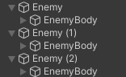

# Tarea Unity

## Autor: Angel Jose Piñeiro Andion

---
## Introducción

El objetivo de esta tarea es desarrollar el juego Rollaball cuyo proceso de creacion figura en el repositorio de proyectos de aprendizaje de Unity.

El desarrollo del proyecto se ha realizado siguiendo los pasos indicados del repositorio mencionado, pero se han añadido algunas mejoras y cambios en el juego tal y como se ha indicado en las clases.

### Repositorio: ###
https://learn.unity.com/project/roll-a-ball?uv=2022.3

No entrare en detalle del proceso de creación básico, solo en las modificaciones añadidas y en los scripts creados.

---

## Modificaciones

### 1. Personalización del tablero:

Aunque en el tutorial de Unity se utiliza un tablero básico en el que se añaden objetos, en clase se nos ha pedido que creemos un tablero personalizado.

Para ello, he creado dos copias mas del tablero, y las he comunicado mediante saltos creados por objetos 3D y pasillos.

### 2. Añadir estilos de camara:

Tal y como se nos pidio, he añadidio varios estilos de camara entre los cuales se alterna pulsando la tecla "c".

Estos estilo son una camara desde arriba que va girando sola al rededor del tablero, una totalmente desde arriba y una que se mueve en función del giro del ratón.

También he implementado una camara en primera persona pero no se puede activar en la version final del juego, si no que se puede activar cambiando el script de camara.

**nota**: El script CameraController1.cs es el que se usa en el tutorial base, no esta en el juego final.

#### CÁMARAS DEL JUEGO:

**script**: cameratotalcontroller.cs

#### CÁMARA PRIMERA PERSONA:

**script**: camera2.cs

### 3. Añadir estados del jugador:

El jugador tres estados. **Unboosted, Boosted, y Hidden**.

- El estado **Unboosted** es el estado incial del jugador, la bola se mueve a una velocidad normal y es de colo blanco.

- El estado **Boosted** es el estado en el que la bola se mueve a una velocidad mayor y es de color rojo. Esto se activa caundo la bole coje 5 coleccionables

- El estado **Hidden** es el estado en el que la bola se vuelve oculta y a los enemigos les cuesta mas seguirla. Se actva cuando la bola entra en la zona nor-este del tablero, y se desactiva cuando sale de ella.

      public enum playerState
          {
          unboosted,
          boosted,
          hidden // Estado 'hidden' añadido
          }

Los estados estan definidos en playerControl.cs igual que la la lógica del cambio de estados.

En el script HiddenTriger.cs esta la lógica de activación y desactivación del estado Hidden. Este script esta vinculado al suelo del area nor-este del tablero.

### 4. Añadir mas enemigos:

Para esto simplemente he duplicado dos veces al enemigo, les he dado otras coordenadas de inicio y les he modificado las dimensiones para que parezcan enemigos diferentes.

### Hacer apk:

Finalmente he creado un apk del juego para poder jugarlo en el móvil tal y como se nos pidió en clase. Y le modifico los controles en PlayerControl.cs para que se me mueva con el acelerometro.

    Vector3 dir = Vector3.zero;
    dir.x = -Input.acceleration.y;
    dir.z = Input.acceleration.x;
    if (dir.sqrMagnitude > 1)
    dir.Normalize();

    dir *= Time.deltaTime;
    transform.Translate(dir * speed);

